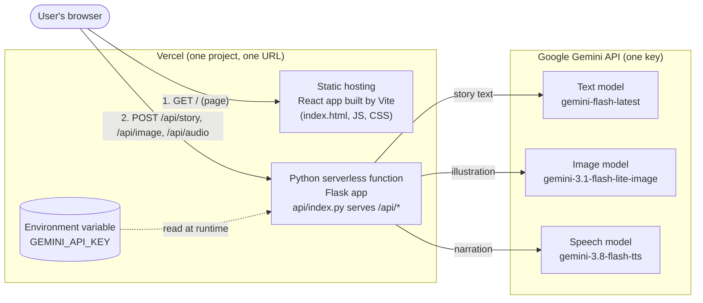
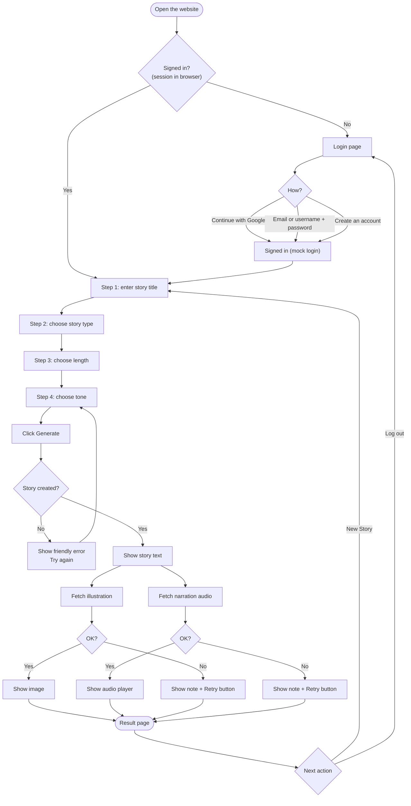
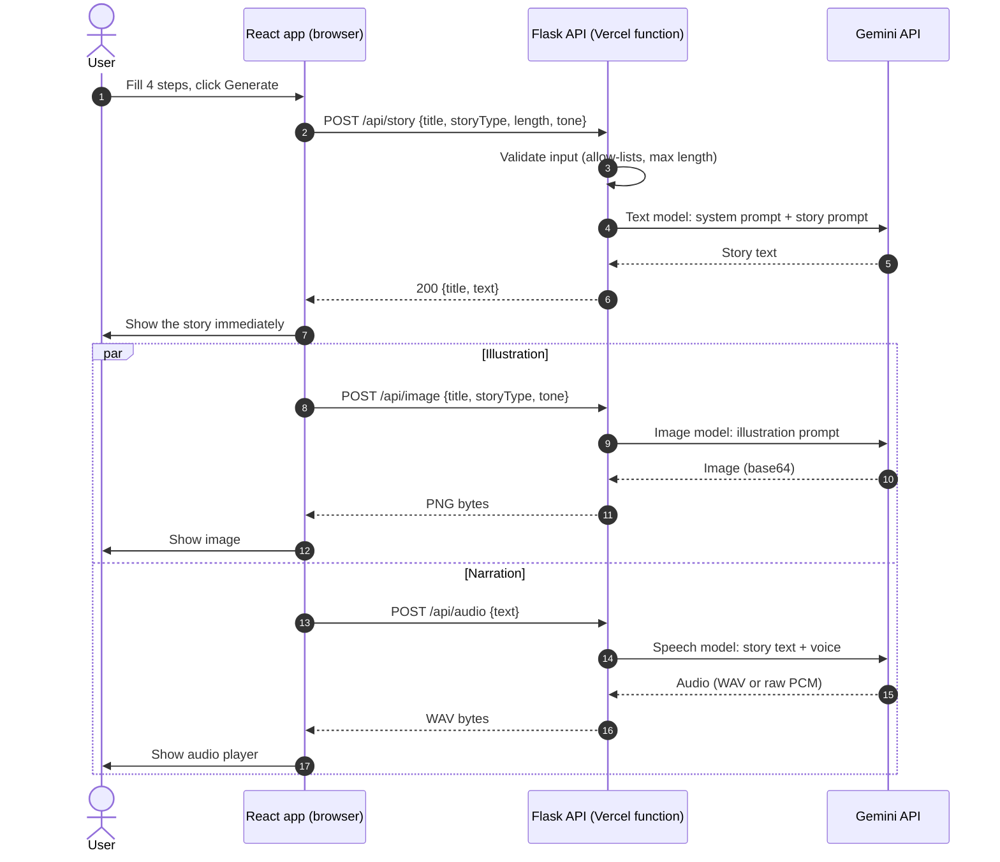
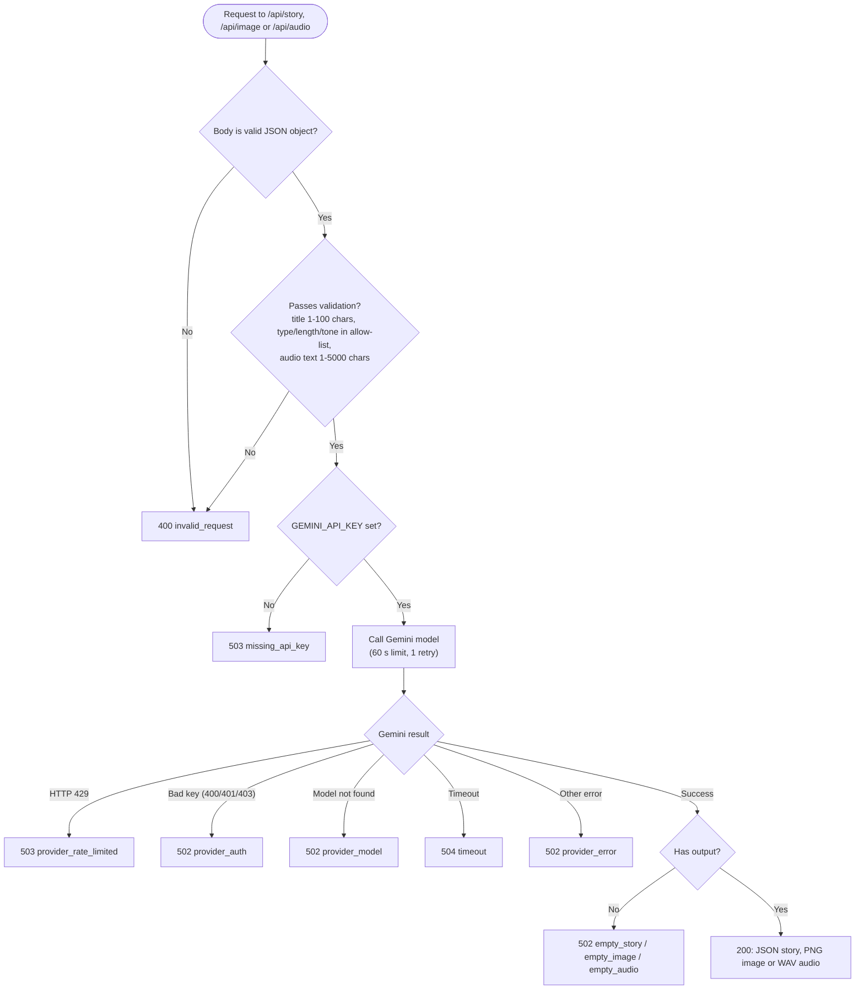
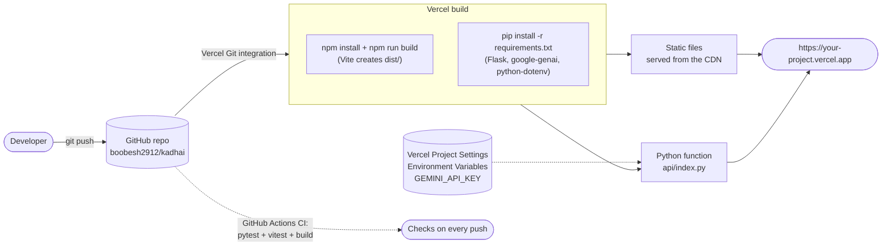
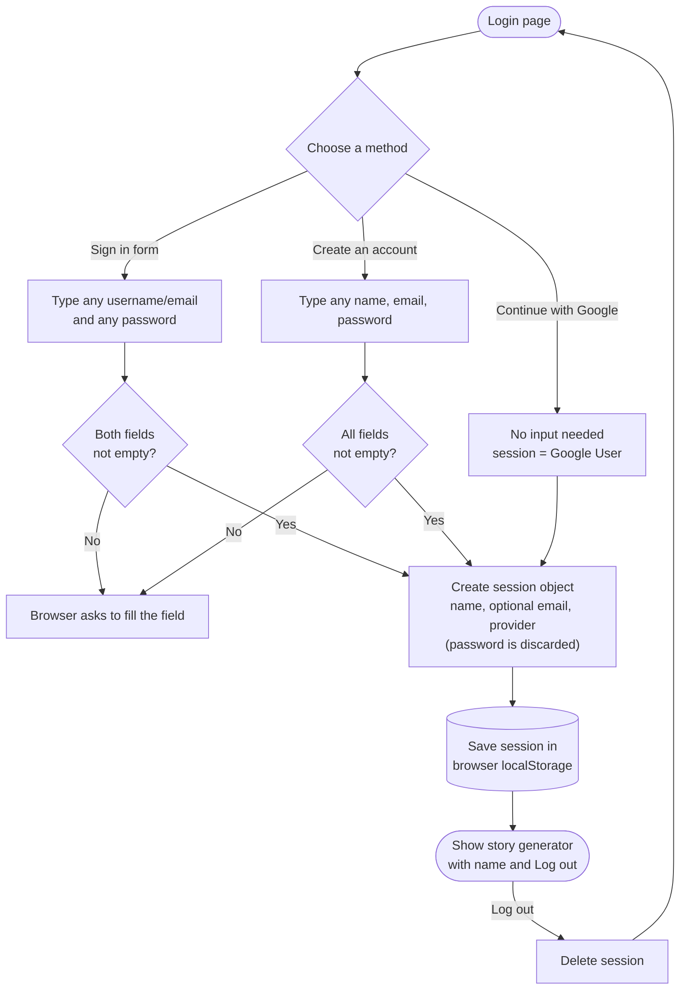

# KADHAI - AI Story Generator

[](https://github.com/boobesh2912/Kadhai/actions/workflows/ci.yml)

KADHAI ("kadhai" means *story*) is a full-stack web app. You pick a title, a story type, a length and a tone, and it creates:

- a **story** (text),
- a matching **illustration** (image),
- a **narration** (audio you can play).

All three come from **Google Gemini**, using a single API key and one model per task. The app has a **mock login** (Google-style button, email/username form and sign-up; any input is accepted) in front of the generator, a light, flat SaaS-style interface, and a storybook-style reader.

| Layer | Technology |
| --- | --- |
| Frontend | React 19 + Vite (built to static files) |
| Backend | Python 3.12, Flask (runs as a Vercel serverless function) |
| AI | Google Gemini API through the official `google-genai` SDK |
| Hosting | Vercel (static frontend + Python function in one project) |
| Tests / CI | pytest, Vitest, GitHub Actions |

## Contents

1. [How it works](#how-it-works)
2. [Project structure](#project-structure)
3. [API keys and environment variables](#api-keys-and-environment-variables)
4. [Run locally](#run-locally)
5. [Deploy to Vercel](#deploy-to-vercel)
6. [API reference](#api-reference)
7. [Mock login](#mock-login)
8. [Running without an API key](#running-without-an-api-key)
9. [Testing](#testing)
10. [Known limitations](#known-limitations)
11. [Diagrams for reports](#diagrams-for-reports)

## How it works

### System architecture



The React app is built once and served as static files. Anything under `/api/*` is routed to one Python function (`api/index.py`) that holds the Flask app. The function reads `GEMINI_API_KEY` from its environment and calls three Gemini models. The key never reaches the browser.

### User flow



### One story, step by step

The story text is requested first and shown immediately. The illustration and narration are then requested **in parallel**, so a failure in one never hides the story or the other asset (each has its own Retry button).



### Backend request handling



More detail (module responsibilities, design decisions, security notes) is in [docs/ARCHITECTURE.md](docs/ARCHITECTURE.md).

## Project structure

```text
Kadhai/
├── api/
│   └── index.py              # Vercel entrypoint: exposes the Flask `app`
├── backend/                  # Python backend
│   ├── app.py                #   Flask app factory and routes
│   ├── config.py             #   environment variables and defaults
│   ├── gemini.py             #   single place that calls Gemini
│   ├── errors.py             #   ApiError + mapping of Gemini errors
│   ├── validation.py         #   request validation (allow-lists, lengths)
│   └── services/
│       ├── story.py          #   text model
│       ├── image.py          #   image model
│       └── audio.py          #   speech model (+ PCM to WAV)
├── src/                      # React frontend
│   ├── main.jsx, App.jsx     #   entry and the 4-step wizard
│   ├── api.js                #   fetch client for /api/*
│   ├── auth.js               #   mock-login session logic
│   ├── useDemoMode.js        #   asks /api/health whether a key is configured
│   ├── useTypewriter.js      #   word-by-word text reveal
│   ├── constants.js, styles.css
│   ├── demo/                 #   built-in sample story + vector illustrations
│   └── components/           #   LoginPage, ChoiceStep, StoryBook, StoryResult, ...
├── tests/                    # pytest (backend)
├── scripts/check_gemini.py   # tests your key against the 3 models
├── docs/                     # ARCHITECTURE.md, DEPLOYMENT.md, diagrams/
├── index.html, vite.config.js, package.json
├── requirements.txt          # production Python dependencies
├── requirements-dev.txt      # + pytest
├── vercel.json               # build, routing and function settings
├── .env.example              # names of the environment variables
└── .github/workflows/ci.yml  # tests + build on every push
```

## API keys and environment variables

You need **one key**: a Gemini API key.

| Variable | Required | What it is | Where to get it |
| --- | --- | --- | --- |
| `GEMINI_API_KEY` | **Yes** | Powers story text, illustration and narration | Create it free in [Google AI Studio](https://aistudio.google.com/apikey) |
| `GEMINI_TEXT_MODEL` | No | Default `gemini-flash-latest` | - |
| `GEMINI_IMAGE_MODEL` | No | Default `gemini-3.1-flash-lite-image` | - |
| `GEMINI_TTS_MODEL` | No | Default `gemini-3.8-flash-tts` | - |
| `GEMINI_TTS_VOICE` | No | Default `Kore` | - |
| `GEMINI_TIMEOUT` | No | Seconds per Gemini call, default `55` | - |
| `DEMO_MODE` | No | Set to `true` to serve the built-in sample story even when a key is set | - |

**Where to put it**

- **On Vercel (required for the live site):** Project → *Settings* → *Environment Variables* → add `GEMINI_API_KEY` for *Production* (and *Preview* if you want preview deployments to work), then **redeploy**. Variables are only picked up by new deployments.
- **On your computer:** copy `.env.example` to `.env` and fill it in (`.env` is git-ignored).
- **Never** put the key in the React code, in a `VITE_...` variable, or in a commit: anything in the browser bundle is public.
- Vercel itself needs no API key if you deploy through the GitHub integration.

**Is it free?** Model IDs and the "free tier" claim come from Google's own cookbook and SDK docs: the image model `gemini-3.1-flash-lite-image` is described there as having a free tier. Google's pricing page was not reachable while this project was built, so the free-tier status of the text and speech models is **not confirmed here**, and Google can change it. Free tiers also have low rate limits. Run this once with your key to see what works on *your* account:

```bash
python scripts/check_gemini.py
```

If a model reports "rate limit or free-tier quota", set the matching `GEMINI_*_MODEL` variable to another model (see [Google's pricing page](https://ai.google.dev/gemini-api/docs/pricing)).

## Run locally

Prerequisites: Python 3.11+ (3.12 recommended) and Node.js 22.

```bash
git clone https://github.com/boobesh2912/Kadhai.git
cd Kadhai

# 1) Backend
python -m venv .venv
source .venv/bin/activate            # Windows PowerShell: .venv\Scripts\Activate.ps1
pip install -r requirements-dev.txt
cp .env.example .env                 # Windows: copy .env.example .env  -> then put your key in .env
python -m backend.app                # API on http://127.0.0.1:5001

# 2) Frontend (second terminal)
npm install
npm run dev                          # open http://localhost:5173
```

Vite forwards `/api/*` to the Flask server on port 5001 (see `vite.config.js`), which mirrors how Vercel routes requests in production.

## Deploy to Vercel

1. Push the code to GitHub (the production branch is `main` by default).
2. On [vercel.com/new](https://vercel.com/new) import the repository. Vercel reads `vercel.json`, so no build settings need changing.
3. Add the `GEMINI_API_KEY` environment variable (see above).
4. Click **Deploy**. You get a `https://<project>.vercel.app` URL.
5. Open `https://<project>.vercel.app/api/health`. It should show `"gemini_key_set": true`.

Step-by-step with troubleshooting: [docs/DEPLOYMENT.md](docs/DEPLOYMENT.md).



## API reference

All endpoints are under `/api`, accept and return JSON (except where noted) and are never cached.

| Method and path | Request body | Success response |
| --- | --- | --- |
| `GET /api/health` | - | `{"status":"ok","gemini_key_set":true,"demo_mode":false}` (never shows the key) |
| `POST /api/story` | `{"title","storyType","length","tone"}` | `200 {"title","text"}` |
| `POST /api/image` | same as `/api/story` | `200` image bytes (`image/png` or the model's type) |
| `POST /api/audio` | `{"text"}` (1-5000 chars) | `200` audio bytes (`audio/wav`) |

Allowed values: `storyType` = `adventure`, `animal`, `friendship`, `fairy-tale`, `space`, `ocean`; `length` = `short`, `medium`, `long`; `tone` = `fun`, `exciting`, `gentle`, `funny`, `magical`; `title` = 1-100 characters.

Errors are always `{"error": "<message>", "code": "<code>"}`:

| HTTP | `code` | Meaning |
| --- | --- | --- |
| 400 / 413 | `invalid_request` | Bad JSON, missing or invalid field, body too large |
| 503 | `missing_api_key` | `GEMINI_API_KEY` is not set on the server |
| 503 | `provider_rate_limited` | Gemini rate limit or free-tier quota reached |
| 502 | `provider_auth` | Gemini rejected the key |
| 502 | `provider_model` | The configured model was not found |
| 504 | `timeout` | Gemini did not answer in time |
| 502 | `provider_unreachable`, `provider_error` | Network or other Gemini failure |
| 502 | `empty_story`, `empty_image`, `empty_audio` | Gemini answered without the expected output |

## Mock login

The login screen is a **mock** (useful for presentations):

- *Continue with Google* signs in instantly as "Google User" (no Google account is involved).
- *Email or username + password* signs in with **any non-empty values**; the name shown is derived from what you type.
- *Create an account* accepts any name, email and password.
- Only the display name is kept in the browser's `localStorage` so a refresh keeps you signed in. **Passwords are never stored or sent anywhere.** *Log out* deletes the session.



It is not real security: it only gates the user interface (see [limitations](#known-limitations)).

## Running without an API key

If `GEMINI_API_KEY` is not set (or `DEMO_MODE=true`), the app still works end to end without calling any AI service. `/api/health` then reports `"demo_mode": true`, and the frontend:

- shows a built-in, pre-written funny story ("A man and his car", about 310 words, five pages) whatever options are chosen, under the title you typed;
- shows hand-drawn vector illustrations for each page (`src/demo/Illustrations.jsx`);
- reveals each page word by word and offers *Read aloud* through the browser's built-in voice;
- is also used if the API cannot be reached at all.

As soon as a key is configured (and `DEMO_MODE` is not `true`), the same screens use real Gemini output instead. This content is **pre-written, not generated**, so say so when describing the project.

## Testing

```bash
python -m pytest -q       # 42 backend tests
npm test                  # 31 frontend tests (Vitest)
npm run build             # production build
```

The backend tests run the real `google-genai` SDK against a local fake Gemini server, so request shapes, response parsing and error mapping are exercised without an API key or network. The same checks run on every push in GitHub Actions (`.github/workflows/ci.yml`).

## Known limitations

- **Live Gemini calls are only as verified as your key allows.** The automated tests use a fake server. Use `python scripts/check_gemini.py` to confirm all three models work with your key before presenting.
- **Free-tier limits are low and can change.** Narration is one request for the whole story; very long stories may be slow or hit limits.
- **The mock login is not security.** The `/api/*` endpoints themselves are public: anyone who finds the URL can spend your Gemini quota. For a public deployment, add rate limiting (for example Vercel's firewall rules) and keep the key's quota capped.
- **60-second function limit.** `vercel.json` sets `maxDuration` to 60 seconds, the safe value for every plan; each Gemini call is cut off at 55 seconds and reported as a timeout.
- **Without a key the story is pre-written.** See [Running without an API key](#running-without-an-api-key): the text and pictures are built in, not generated.
- **No story history.** Nothing is saved on a server; stories exist only in the open page.

## Diagrams for reports

All flowcharts are in [docs/diagrams](docs/diagrams) as editable Mermaid sources (`.mmd`) plus ready-to-insert **PNG** and **SVG** exports:

| File | Shows |
| --- | --- |
| `01-system-architecture` | Browser, Vercel (static + Python function), Gemini models |
| `02-user-flow` | Everything a user can do, including error paths |
| `03-sequence-generate-story` | The request sequence between browser, API and Gemini |
| `04-backend-request-flow` | Validation, key check, Gemini call, error mapping |
| `05-deployment-flow` | GitHub push to live Vercel site |
| `06-mock-login-flow` | The mock login |
