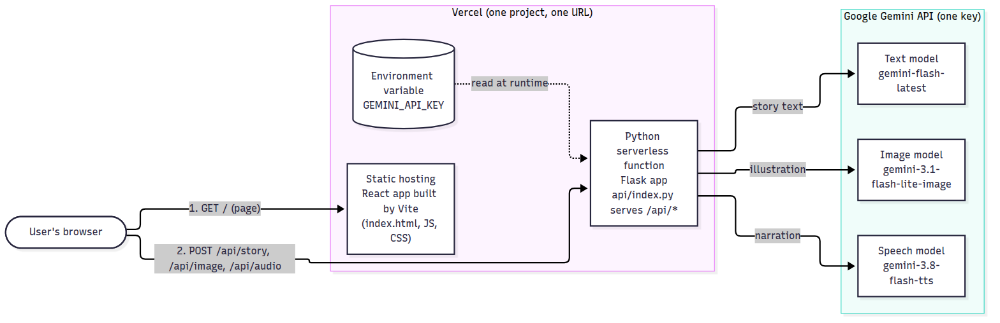
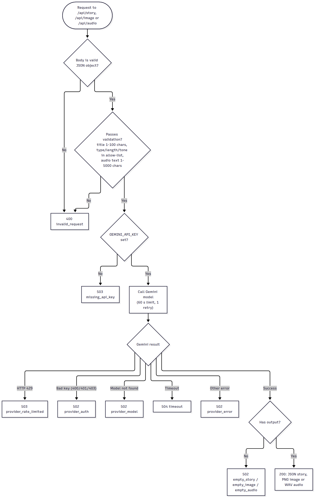
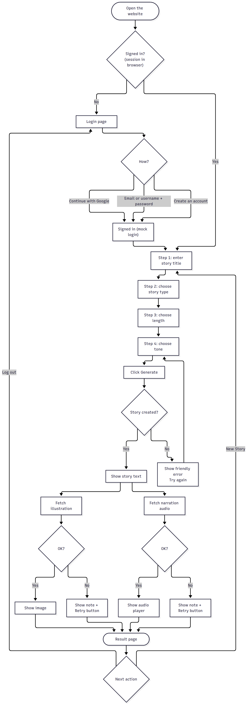
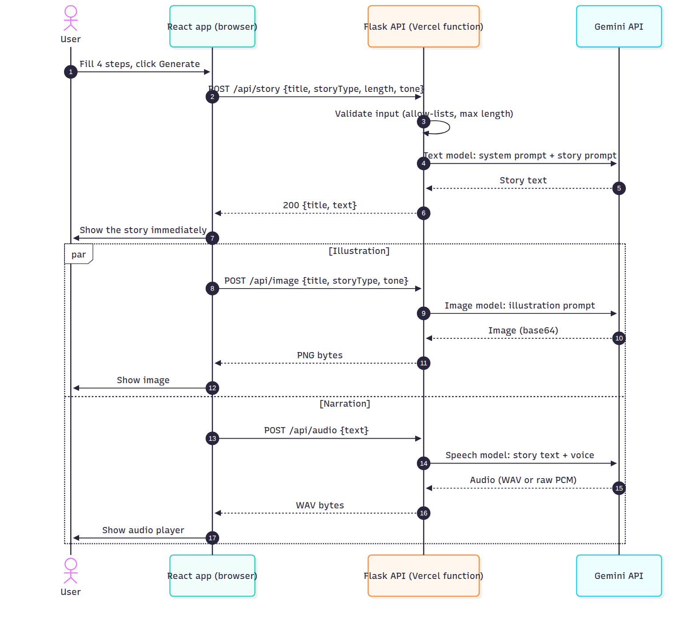
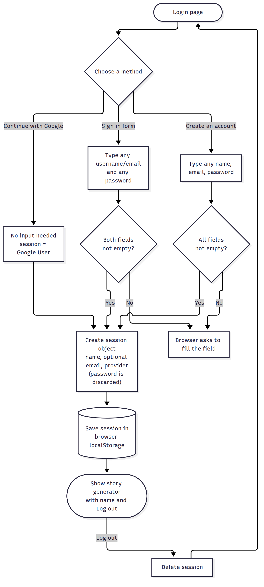
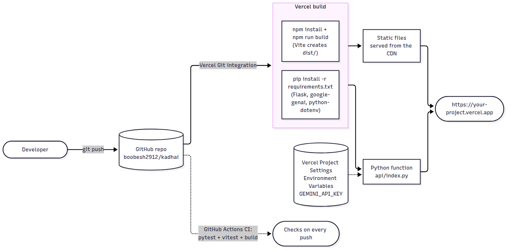

# Architecture

This document explains how KADHAI is put together and why. For setup and deployment see the [README](../README.md) and [DEPLOYMENT.md](DEPLOYMENT.md).

## 1. Big picture

One Vercel project serves two things from one URL:

1. **Static frontend**: a React app built by Vite into plain files (`dist/`).
2. **Python function**: the Flask app in `backend/`, exposed by `api/index.py`, handling every `/api/*` request.

`vercel.json` ties them together:

| Setting | Purpose |
| --- | --- |
| `framework: vite`, `buildCommand`, `outputDirectory: dist` | Build and serve the React app |
| `rewrites: /api/(.*) -> /api/index` | Send every API path to the single Python function; Flask then routes by the original path |
| `functions["api/index.py"].maxDuration: 60` | Allow up to 60 s per request (the safe maximum across plans) |
| `functions[...].excludeFiles` | Keep `node_modules`, `src`, `tests`, `docs` out of the Python bundle |

## 2. Backend (`backend/`)

| Module | Responsibility |
| --- | --- |
| `app.py` | `create_app()`: routes, JSON error handlers, `Cache-Control: no-store`, 64 KB body limit |
| `validation.py` | Turns raw JSON into trusted values: allow-lists for type/length/tone, title 1-100 chars, audio text 1-5000 chars |
| `config.py` | Reads environment variables lazily (so tests and Vercel changes apply without re-import); holds defaults |
| `gemini.py` | The only code that talks to Gemini: builds the SDK client, makes the call, converts SDK exceptions |
| `errors.py` | `ApiError` (message + stable `code` + HTTP status) and `map_gemini_error()` |
| `services/story.py` | System prompt + user prompt, returns `interaction.output_text` |
| `services/image.py` | Illustration prompt, requests an image, base64-decodes it |
| `services/audio.py` | Cleans markdown, requests speech, returns WAV (wraps raw PCM when needed) |

### Request lifecycle

### Why these design choices

- **Three endpoints instead of one.** Story, image and audio each have their own request and time budget. The story appears as soon as it is ready, and a slow or failing image/narration never blocks it. The frontend retries each asset individually.
- **No files written to disk.** The original prototype saved images and audio into `static/`. Vercel functions have no persistent, writable project folder, so the API now returns the bytes in the HTTP response (image and audio) and the browser turns them into object URLs.
- **Binary responses, not base64 in JSON.** Smaller (no 33 % overhead) and well inside Vercel's response-size limit for typical stories.
- **One SDK, one key.** All three models are reached through the `google-genai` SDK's Interactions API with a single `GEMINI_API_KEY`. Model IDs are environment variables so a rename or a free-tier change is a settings change, not a code change.
- **Limited retries.** The SDK retries 429/5xx responses three times by default (about 3.4 s in tests). `gemini.py` reduces this to one retry so a rate-limited call fails fast and does not burn the function time limit.
- **Error mapping by shape, not by import.** Gemini reports an invalid key as HTTP 400 ("API key not valid"), not 401. `map_gemini_error()` checks the status code *and* the message, and recognises timeouts by class name because the SDK's error classes live in a private module.
- **User-safe errors.** Every error returned to the browser is a fixed message with a stable `code`. Raw provider messages go only to the server log (stderr), and the API key is never included.
- **Same-origin API.** The frontend calls relative `/api/...` URLs, so no CORS configuration is needed in production (the old prototype's open CORS was removed). In development Vite proxies `/api` to Flask.

## 3. Frontend (`src/`)

| File | Responsibility |
| --- | --- |
| `App.jsx` | Top-level state: session, wizard step (1-4, result = 5), loading/error; aborts in-flight requests on reset/unmount |
| `components/LoginPage.jsx` | Google-style button, email/username form, sign-up tab |
| `components/ChoiceStep.jsx` | Accessible radio-button grid used for type, length and tone |
| `components/StoryResult.jsx` | Shows the story and loads image + audio independently (`useAsset` hook with loading / ready / error / retry, and object-URL cleanup) |
| `api.js` | `createStory`, `createImage`, `createAudio`; turns error bodies into `ApiRequestError` |
| `auth.js` | Pure mock-login logic and `localStorage` handling (testable without a browser) |
| `constants.js` | Option lists (must match `backend/config.py`) |

### User flow

### Sequence of one story

## 4. Mock login

A pure front-end feature. `createSession()` builds `{provider, name, email, signedInAt}` from whatever was typed (the password is never read into the session) and `saveSession()` stores it in `localStorage`. The Google button creates a fixed "Google User" session with no input. The backend does not know about users, so the API is not protected by it.

## 5. Gemini usage

| Task | Default model | How it is called |
| --- | --- | --- |
| Story text | `gemini-flash-latest` | `interactions.create(model, system_instruction, input)` then `output_text` |
| Illustration | `gemini-3.1-flash-lite-image` | `interactions.create(model, input, response_modalities=["image"])` then `output_image` |
| Narration | `gemini-3.8-flash-tts` | `interactions.create(model, input, response_format={"type":"audio"}, generation_config={"speech_config":[{"voice":"Kore"}]})` then `output_audio` |

Model IDs and call shapes come from Google's `python-genai` README and `google-gemini/cookbook` notebooks. Non-streaming TTS returns a complete WAV (24 kHz, mono, 16-bit); if raw PCM is ever returned, `pcm_to_wav()` wraps it.

## 6. Deployment

## 7. Testing strategy

- **Backend (pytest, 42 tests):** a local fake Gemini HTTP server is started per test and the *real* SDK is pointed at it with `GEMINI_BASE_URL`. This checks the exact request the SDK sends (path, `x-goog-api-key` header, body fields), response parsing for text/image/audio, and error mapping for 429/400-invalid-key/403/404/500, without a key or network.
- **Frontend (Vitest, 31 tests):** the API client (success, error bodies, gateway timeout, network failure, aborts, blob URLs, health check), the built-in sample story (length, pages, abort handling, pagination, typing tokenizer) and the mock-login logic (any input accepted, persistence, corrupt/blocked storage, password never stored).
- **Manual end-to-end:** during development the whole app (Vite + Flask + SDK + fake Gemini) was driven in Chromium through login, all four steps, image/audio success, per-asset failure with Retry, story failure, and a 375 px mobile layout.
- **Deployment config:** `vercel build` was run locally with the real Vercel CLI; it produced the expected routes (`/api/*` to the Python function, other paths static), Python 3.12, `maxDuration: 60` and a ~82 MB function bundle without `node_modules`/`src`/`tests`.

## 8. Running without an API key

`/api/health` reports `demo_mode: true` when `GEMINI_API_KEY` is missing (or `DEMO_MODE=true`). `useDemoMode.js` reads it once on load; if it says so, or the API cannot be reached, `App.jsx` calls `createDemoStory()` instead of `/api/story`. That returns a pre-written five-page story after a short delay, `StoryResult` draws each page's illustration from `src/demo/Illustrations.jsx` (flat SVG, no external images), `StoryBook` reveals the text word by word (`useTypewriter.js`) and `ReadAloud` uses the browser's speech synthesis. With a key configured, none of this code runs and the real Gemini endpoints are used.

## 9. Extending

- **Different voice or model:** change `GEMINI_TTS_VOICE` / `GEMINI_*_MODEL` in the environment.
- **Real authentication:** replace `auth.js` and add token checks in `backend/app.py` (for example a `before_request` hook), then rate-limit per user.
- **Saved stories:** add a database and a `/api/stories` route; the current design is stateless by choice.
